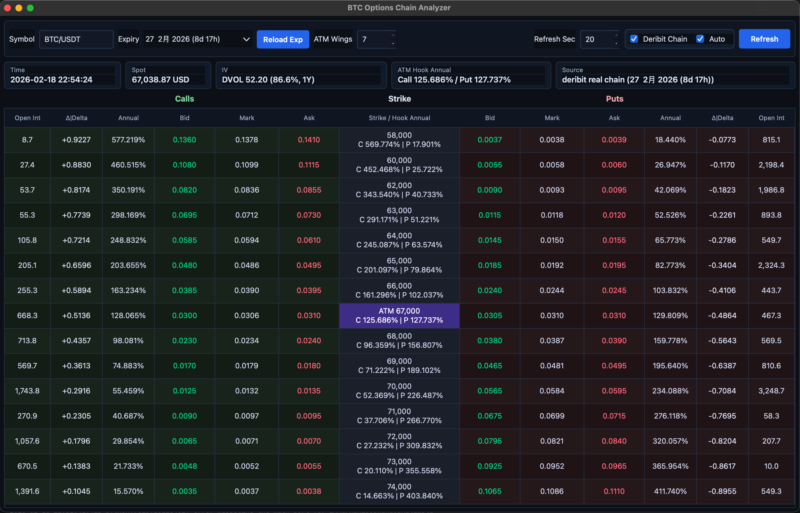

# BTC Options Chain Analyzer

`BTC Options Chain Analyzer` 是一個用 Python + PySide6 製作的桌面工具，用來同時查看：
- 理論選擇權價格（Binance 模型模式）
- 實際交易所報價（Deribit 真實鏈）

重點是把兩種視角放在同一個介面，方便快速比較。

## 核心價值
- 同一套 UI 同時支援「模型定價」與「交易所即時報價」。
- 在 Deribit 原始報價之外，補上年化視角：各腿 `Annual`（以 `Bid` 模擬可賣出價格）

## 功能總覽
- Deribit 風格鏈表：`Calls | Strike | Puts`
- 以 ATM 為中心顯示上下翼 (`ATM Wings`)
- 點擊互動高亮：
  - 點左側欄位高亮 Calls 半邊
  - 點右側欄位高亮 Puts 半邊
- 可設定自動刷新秒數 (`Refresh Sec`)
- 背景執行資料抓取，不阻塞 UI
- 視窗放大時介面會等比例調整

## 資料模式

### 1) Deribit Chain（真實交易所資料）
- 來源：Deribit public API
- 可選到期日 (`Expiry`) 與重載到期日 (`Reload Exp`)
- 顯示真實 `Bid/Mark/Ask`
- 補上年化資訊：`Annual`（以 `Bid` 模擬可賣出價格）
- `Spot` 以 `USD` 顯示
- `IV` 卡片顯示為：
  - `DVOL 當前值`
  - `1Y 百分位（%）`
  - 例：`DVOL 52.09 (86.3%, 1Y)`

### 2) Binance Model（理論模型）
- 來源：Binance spot（透過 `ccxt`）
- IV 使用 30 日歷史波動率（HV）近似
- Strike 格：
  - 間距固定 `1000`
  - 範圍為 `ATM +/- ATM Wings`
- `Model Days` 會影響模型價格、Delta、ITM 機率與年化結果

## 欄位說明
- `Open Int`：Deribit 模式為未平倉量
- `ITM Prob`：Binance 模式為模型估計到價內機率
- `Δ|Delta`：Delta
- `Annual`：以 Bid 價換算的年化（模擬可賣出）
- `Bid / Mark / Ask`：買價 / 中間價 / 賣價
- `Strike`：中間欄位僅顯示履約價

## 安裝
```bash
pip install -r requirements.txt
```

## 執行
```bash
python main.py
```

## Screenshot


## 注意事項
- 本工具僅供分析，不構成任何投資建議。
- Binance 模式為模型估算，不等於市場真實隱含波動率。
- Deribit 模式依賴外部 API 與網路狀態。
